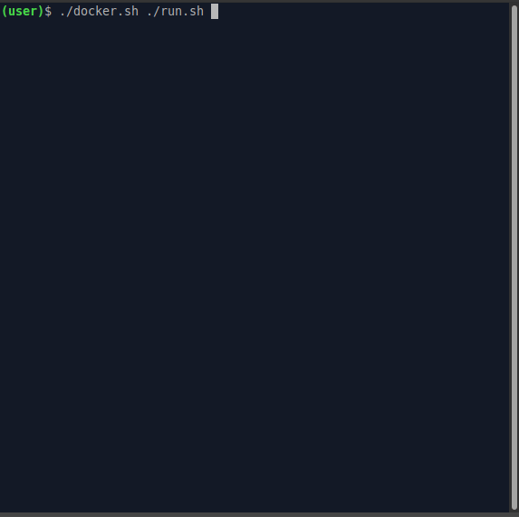

## Command line interface for embedded controllers based on RTEMS OS

### This is an example of using [ile-cli] for [RTEMS] RTOS.

RTEMS (Real-Time Executive for Multiprocessor Systems)  is a real-time operating
system kernel used around the world and in space. RTEMS is a free real-time
operating system (RTOS) designed for deeply embedded systems such as automobile
electronics, robotic controllers, and on-board satellite instruments ([1],[2]).

This example is the result of a study of this OS. I was interested in learning
how to build an image and create applications for it. At the moment, this project
is used as a base for creating embedded controller applications based on x86 CPU
and ARM-microcontrollers [LPC1768] .

Perhaps this work will be interesting to someone and you will use this knowledge
to create your own systems.



### Build

Make some preparations once before start the building process:
```
git clone https://github.com/maxpoliak/rtems-ec-cli.git && ./rtems-ec-cli/preparations.sh
```

Use the help to print all the available commands:

```
./build.sh help
```
```
Use ./build.sh [COMMANDS...]
  all         Build all: cross-compiler, RTEMS OS and ile-cli application
  rtems       Build RTEMS OS
  cross       Build cross-compiler
  cleanall    Clear all
  rebuild     Set rebuild flag
              Delete the application's object files before building it
  help        Print help
```

For the first build, use the build script with the "-a" or "all" option to build
all components of the project. As a result, you will build a cross compiler,
RTEMS OS and the ile-cli application itself.

```
./build.sh all
```

Build the application only, without rebuilding tools and RTEMS OS:
```
./build.sh
```
The Waf build system ([3],[4]) is used for the output executable file of the
application.

Use the docker.sh scripts to run in the [docker] container.

```
./docker.sh ./build.sh all
```
### Test

Test the result in [QEMU] using the script:

```
./run.sh
```

[1]: https://summerofcode.withgoogle.com/archive/2019/organizations/4579649638629376/
[2]: https://en.wikipedia.org/wiki/RTEMS
[3]: https://en.wikipedia.org/wiki/Waf
[4]: https://devel.rtems.org/wiki/Docs/Build

[LPC1768]: https://www.nxp.com/products/processors-and-microcontrollers/arm-microcontrollers/general-purpose-mcus/lpc1700-cortex-m3:MC_1403790745385#/
[docker]: https://en.wikipedia.org/wiki/Docker_(software)
[ile-cli]: https://github.com/maxpoliak/ile-cli
[RTEMS]: https://www.rtems.org/
[QEMU]: https://www.qemu.org/
