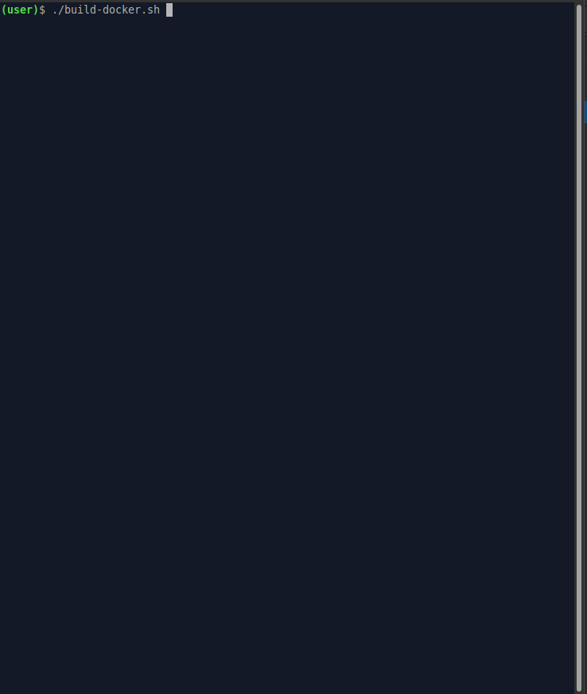

## rtems-ec-cli

This is an example of using [ile-cli] for [RTEMS] RTOS based microcontrollers.



```
(ubuntu-user)$ ./build.sh -h | or | ./build-docker.sh -h
Use ./build.sh [OPTIONS...]
    -a Build all: cross-compiler, RTEMS OS and ile-cli application
    -c Clear all
    -r Delete the application's object files before building it
    -h Print help
```
Build the application only
```
(ubuntu-user)$ ./build.sh
```

Run [RTEMS] OS with [ile-cli] application on [QEMU]
```
./run.sh | or | run-docker.sh
```

[ile-cli]: https://github.com/maxpoliak/ile-cli
[RTEMS]: https://www.rtems.org/
[QEMU]: https://www.qemu.org/
